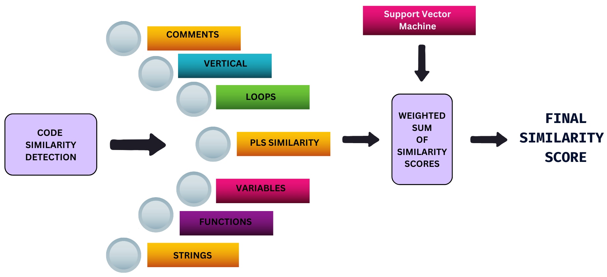
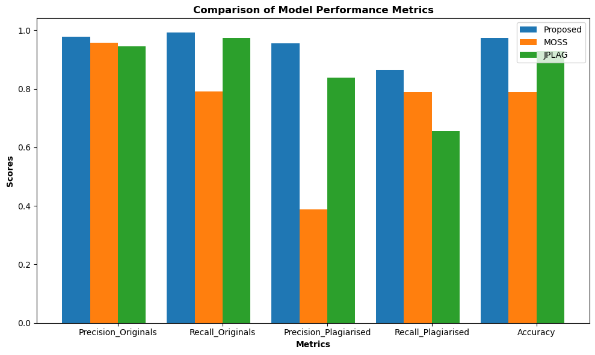

# A Support Vector Machine–based Approach to Plagiarism Detection in Python Code

Research implementation accompanying the article:

**Gandhi N., Gopalan K., Prasad P. (2024).** *A Support Vector Machine based approach for plagiarism detection in Python code submissions in undergraduate settings.* Frontiers in Computer Science. https://doi.org/10.3389/fcomp.2024.1393723

This repository includes the research code (`main_model21.py`), the paper PDF, and figures from the article for quick reference. No datasets or MOSS/JPlag outputs are included.

---

## Key results (exactly as reported)
- **Accuracy (overall):** Proposed **0.973** (204/210) vs. **JPlag 0.929** (195/210) vs. **MOSS 0.790** (166/210).
- **Originals (precision):** Proposed **0.978**, **MOSS 0.958**, **JPlag 0.945**. **Originals (recall):** Proposed **0.991**, **JPlag 0.974**, **MOSS 0.790**.
- **Plagiarized class (precision):** **MOSS ≈ 0.387**, proposed and JPlag higher (see Figure 2).
- **Avg. errors (per 210-sample test):** Proposed ~**2 FP / 4 FN**; JPlag ~**5 FP / 10 FN**; MOSS ~**38 FP / 6 FN**.
- **Significance:** ANOVA + Tukey HSD show **p < 0.001** pairwise differences across metrics.

---

## Figures (from the published paper)

> **Figure 1 (original caption)**: "Illustration the methodology for code similarity detection using a weighted sum of several indicators with help of support vector machine model."  
> **Credit**: Gandhi, Gopalan, Prasad (2024), *Frontiers in Computer Science*, CC BY 4.0, https://doi.org/10.3389/fcomp.2024.1393723.

> **Figure 2 (original caption)**: "Comparative analysis of plagiarism detection models."  
> **Credit**: Gandhi, Gopalan, Prasad (2024), *Frontiers in Computer Science*, CC BY 4.0, https://doi.org/10.3389/fcomp.2024.1393723.

---

## Paper PDF
The full article is provided here for convenience:
- [`docs/frontiers-2024-1393723.pdf`](docs/frontiers-2024-1393723.pdf) (CC BY 4.0).

---

## Notes
- This repo makes **no claims** beyond the published article.
- MOSS/JPlag inputs and student data are **omitted**.
- Figures and the PDF are reused under **CC BY 4.0** with attribution; third-party materials (if any) would require their own permissions.

## Citation
See `CITATION.cff` or cite the Frontiers article directly.

## License
Code: MIT (see `LICENSE`).  
Figures & article PDF: © Authors, **CC BY 4.0** (attribution as above).
